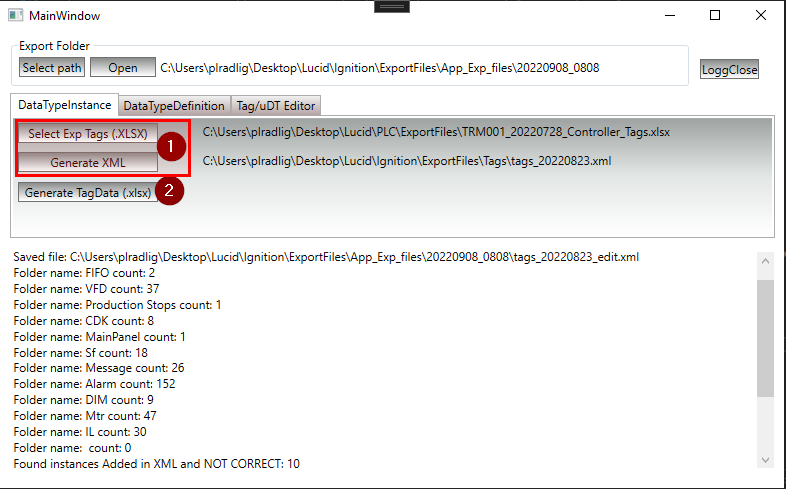
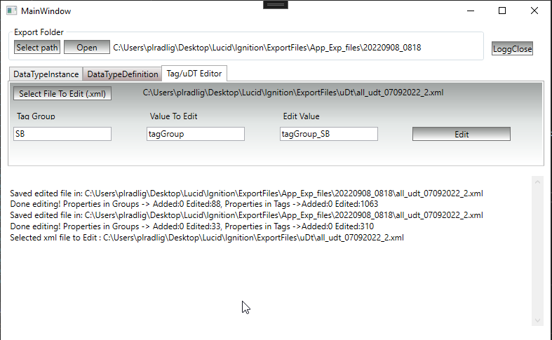

# IgnitionHelper
An app that helps Ignition Visualization Designer with some of the tasks.

Features:
1. Duplicates Instances of Data Types (Exported from Ignition (.xml)) according to Exported Tags (from Studio5000, (.xlsx))
  Note: Data Type name of PLC Data Block needs to consist name of Data Type in Ignition Designer.
  Manual to use feature:
  1.1. Export All PLC tags from Studio 5000 (.csv)
  1.2. Convert .csv file to .xlsx file
  1.3. Export All PLC tags from Ignition Designer (.xml)
  1.4. Click button "Select Exp Tags (.XLSX)" and chose file created in point (1.2)
  1.5. Click button "Generate XML" and chose file created in point (1.3)
  1.6. Import (option "Direct") generated (*_edit.xml) file to Studio 5000 (PLC Tags branch)
2. Creates spreadsheet showing acquired in (1) data set covering PLC Tag used in Allan Bradley and HMI Tag used in Ignition

3. Allows to change/add exported from Ignition xml file containing tags/udts. This feature allows to change typed property to typed value in specified by user group (folder) of tags.
  Manual to use feature:
  3.1. Export All PLC tags/udts from Ignition Designer (.xml)
  3.2. Click button "Select File to Edit (.xml)" and chose file created in point (1.2)
  3.3. Fill 3 labels with correct data:
    -Tag Group (folder containing group of tags, for example SB - Status bits)
    -Value To Edit (property to change, for example tagGroup)
    -Edit Value (expected value of property to change, for example tagGroup_SB)
  3.4. Click button "Edit" to edit selected file with typed in labels data, file will be saved in shown above destination (export folder)
    
