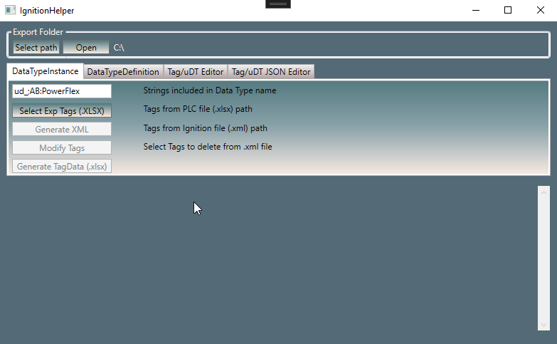
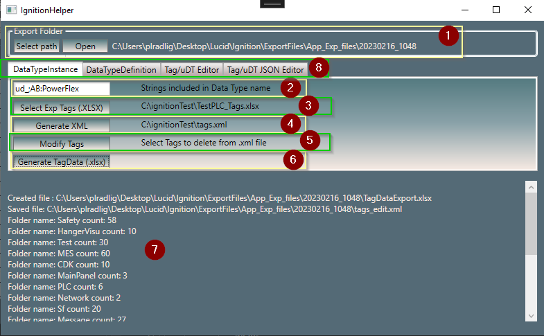
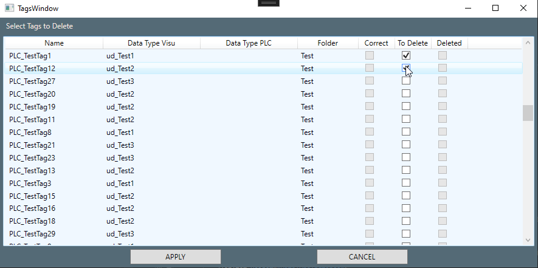
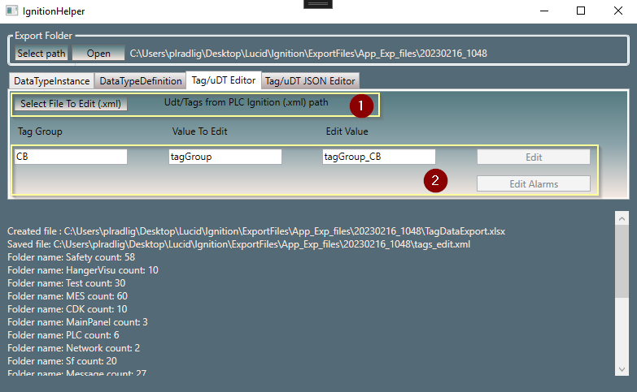
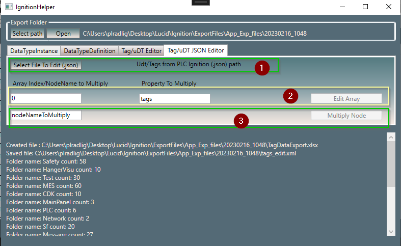

# IgnitionHelper
An app that helps Ignition Visualization Designer with some of the tasks. \

\
Features: \

\
(1) - Select export path / open folder \
(2) - Enter string which needs to be contained in udt name - divide multiple strings with ";" \
(3) - Select (.xlsx) file which contains tags exported from Studio5000 (PLC) \
(4) - Select (.xml) file which contains tags exported from Ignition (HMI) \
(5) - Modify Tags - Open Tags Window which allows user to delete selected tags from (.xml) file \

\
(6) - Generate (.xlsx) file with informations about Tags from PLC and HMI \
(7) - Operations Informations for user \
(8) - Change tab to show other functions \

\
(1) - Select (.xml) file which contains tags exported from Ignition (HMI) \
(2) - After filling textblocks with correct data it is possible to change Tag Value (Value to Edit) in tag group (Tag Group) to typed value (Edit Value) \
\

\
(1) - Select (.json) file which contains tags (containing Array of tags) exported from Ignition (HMI) \
After filling textblocks with correct data it is possible to change Array of tags: \
(2) - Multiply tag property (Property to Multiply) with index (Array Index) to replace tag properties in every other tag in Array \
(3) - Multiply node defined by name (nodeNameToMultiply) to replace every other node (tag in Array) with this node (leaving only old name of node) \
